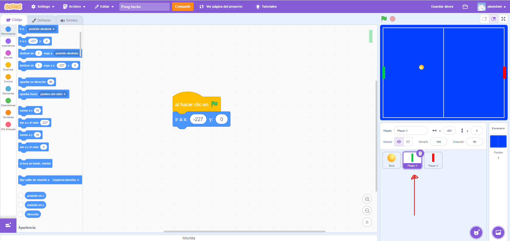

## Introducción

En este tutorial con Scratch veremos cómo programar el videojuego de PONG en su versión para dos jugadores. 

El videojuego consiste en hacer rebotar la pelota sin tocar los laterales de la pantalla en cuyo caso acumulará puntos para tu rival.

### Reinventa, programa y comparte

En este caso, como el juego no lo vamos a acabar en un día, es recomendable que antes de empezar os creéis una cuenta en Scratch para que se vayan guardando los cambios realizados automáticamente.

 

")

- Reinventa el proyecto [Pong 2 Jugadores - https://scratch.mit.edu/projects/924537702/editor](https://scratch.mit.edu/projects/924537702/editor) para obtener todas las imágenes necesarias.

 

## Escenario

En primer lugar, comprueba que tenemos creados 4 escenarios. 

- Los 3 primeros corresponden a la cuenta atrás antes del inicio del juego (3, 2 y 1). 

- El último escenario será la pantalla principal.

### Programación del escenario

Creamos el evento "Inicializar" destinado al cambio de fondos en la cuenta atrás. De esta forma, siempre que invoquemos al evento "Inicializar", empezará la cuenta atrás mostrando los diferentes fondos (3, 2, 1).

Por último, invocamos al evento "Inicializar" para que sea lo primero que se ejecute al presionar la bandera verde.

> Observar que si durante el transcurso del videojuego volvemos a invocar a la función "inicializar", los fondos volverán a cambiarse (3, 2, 1).

 

## Pelota

Nos dirigimos al objeto que utilizaremos como bola, y ajustamos el tamaño deseado. Además, inicializamos los valores por defecto que tomará dicho objeto. En este caso, la posición va a ser la posición 0 en el eje X y la posición 0 en el eje Y, es decir, (0,0).

También le vamos a añadir un ángulo aleatorio de giro. En este caso, vamos a optar por un ángulo comprendido entre 45º y 135º para intentar que el ángulo sea lo más horizontal posible.

### Programación de la pelota

Lo primero que haremos es crear un evento "Comenzar juego" dentro de la bandera verde (en el objeto escenario). Una vez lo tengamos, añadimos el bloque también a la pelota.

La pelota se debe mover N pasos y rebotar si toca el borde. Para indicarle el valor N, creamos una variable llamada "Velocidad".

    NOTA: Como ya sabemos de otras prácticas, siempre que se utilizan variables debemos de inicializarlas a un valor por defecto. 
    En este caso, le asignamos el valor en la función "Inicializar".

Como se puede observar, la velocidad de la bola será siempre la misma. Haremos que se vaya incrementando en niveles posteriores.

 

## Jugadores

En primer lugar, se inicializan las posiciones origen de cada "pala" de los jugadores, en su eje X (valor 227) e Y (valor 0) respectivamente.

 

    OJO: la paleta del jugador de la izquierda tendrá un valor negativo y el de la derecha positivo!!

A continuación, pondremos bloques para que al recibir la llamada del evento "Comenzar juego" cambiemos las posiciones de la coordenada vertical para que la paleta suba o baje según la tecla presionada. *¡CUIDADO, no asignes las mismas teclas para controlar a los dos jugadores distintos!*

    *Para el jugador de la derecha, usa las teclas: flecha arriba y flecha abajo.
    *Para el jugador de la izquierda, elige libremente las teclas. Para este tutorial, pondremos: "q" (arriba) y "a" (abajo).

### Jugador 1

### Jugador 2

Por último, modificamos la programación de la pelota para que rebote no sólo cuando toca un borde, sino que además deberá rebotar si toca cualquiera de las palas de los jugadores. Para eso, multiplicaremos la dirección que tengamos en ese momento por (-1), ya que el rebote debe ser la dirección contraria.

### Pelota actualizada

 

## Marcador (puntos)
Crearemos 2 variables nuevas (Jugador 1 y Jugador 2) donde almacenaremos los puntos de cada jugador. Las inicializaremos a 0 en el evento de bandera verde, y haremos que sean visibles en la pantalla. Dales la posición que más te guste:

 

 

Ahora, haremos que cada vez que la bola toque un borde opuesto al jugador, este sume 1 punto (incrementamos el valor de la variable): 

    Para detectar dichos bordes nos ayudamos de las coordenadas sobre el eje horizontal X, detectando si el valor de X es menor o mayor a 227 para saber a qué jugador sumarle los puntos.
    
    Podríamos pensar que con indicarle que sea mayor o menor a 0 es suficiente, pero dado que hay también bordes superiores e inferiores (eje Y), ¡podría darse el caso de que se sumen puntos incorrectamente!

 

## Puntos - el que llegue a 10 GANA

Si juegas durante mucho tiempo, te darás cuenta de que el videojuego no termina nunca. Vamos a añadir a la programación una condición que muestre un mensaje por pantalla cuando un jugador llegue a 10 puntos. Esta programación la realizaremos en un nuevo escenario que llamaremos GAME OVER.

### Escenario GAME OVER

### Programación GAME OVER

 

## Incrementar velocidad de la pelota con cuenta atrás (cronómetro)
Por último, daremos a la velocidad de la pelota un plus de rapidez cada 25 segundos. 

Para ello, primero nos crearemos una nueva variable "Tiempo" que almacenará una cuenta atrás para guiar a los jugadores:

 

En Scratch, tenemos disponible un cronómetro dentro de los bloques de sensores. Lo primero que haremos será añadir los bloques para reiniciar la variable "Tiempo" y cronómetro al evento "Inicializar" dentro del escenario:

 

A continuación, dentro de los bloques de la pelota, añadiremos un evento nuevo para "Comenzar juego" donde asignemos a la variable "Tiempo" su valor de cuenta atrás: Tiempo - cronómetro.

Como queremos que el contador se reinicie cada 25 segundos, añadimos una condición para que en cuanto la variable "Tiempo" llegue a 0 segundos se reinicie a 25. Además, en ese mismo momento, se deberá incrementar el valor de la variable "Velocidad". *Elige el incremento de velocidad que quieras, ¡pero no te pases o será IMPOSIBLE de jugar!*.

 

## Mejoras a realizar:

- Añadir música de fondo. Debe sonar durante todo el rato, hasta que un jugador pierda.
- Añadir efecto de sonido para cada GOL marcado.
- Cuando un jugador pierda la partida, debe sonar un efecto de sonido distinto.
- Crear / Modificar el fondo GAME OVER a vuestro gusto. Si quieres, puedes modificar también los demás fondos del escenario principal.

